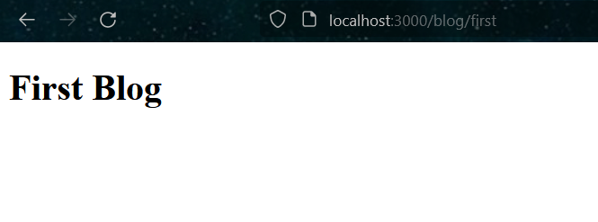
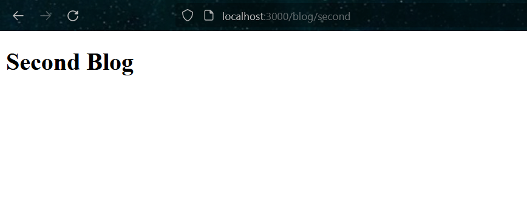

## Laporan Praktikum

|  | Pemrograman Berbasis Framework 2024 |
|--|--|
| NIM |  2141720156|
| Nama |  Versacitta Feodora Ramadhani |
| Kelas | TI - 3I |

### Practicum 1
 
Layout of About page
 

### Practicum 2
 
 
Layout of the first and second page
 
If we create the routing manually like this, then it will be hard for us to assign routing for different pages with slight difference, such as product description page. This is because we have to assign each of the folder and its page individually and modify it according to the information. This will makes it harder to modify the page layout, as it means it needs to change all the pages instead of just one.