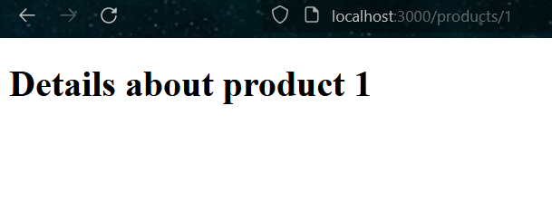
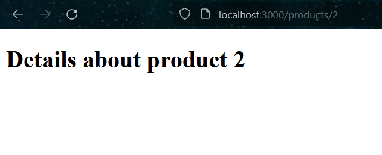
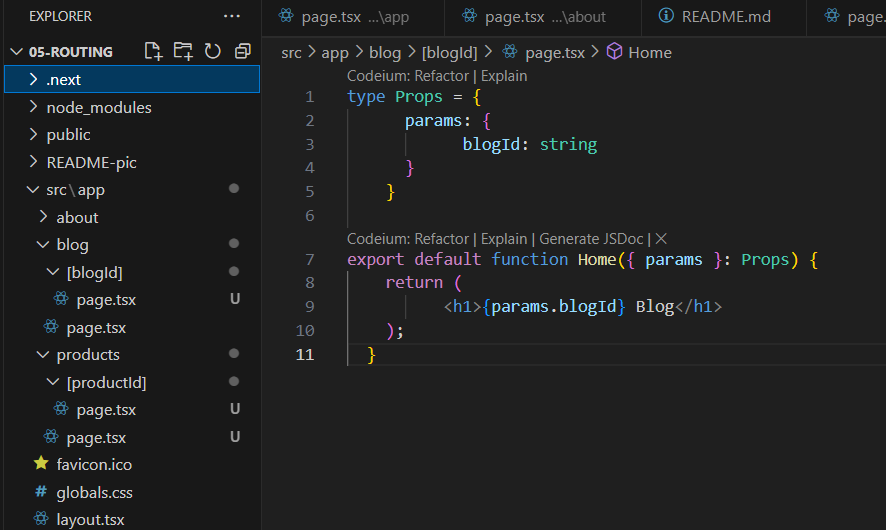
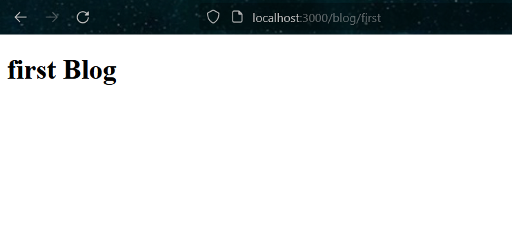
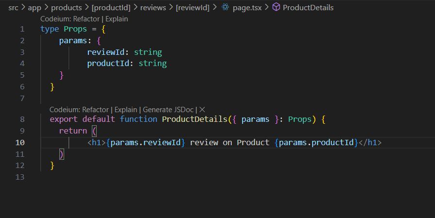

## Laporan Praktikum

|  | Pemrograman Berbasis Framework 2024 |
|--|--|
| NIM |  2141720156|
| Nama |  Versacitta Feodora Ramadhani |
| Kelas | TI - 3I |

### Practicum 1
 
Layout of About page
 

### Practicum 2
 
 
Layout of the first and second page
 
If we create the routing manually like this, then it will be hard for us to assign routing for different pages with slight difference, such as product description page. This is because we have to assign each of the folder and its page individually and modify it according to the information. This will makes it harder to modify the page layout, as it means it needs to change all the pages instead of just one.
 

### Practicum 3
 
 
Layout of the first and second page.  
When using dynamic routing, the folder and code for blog routing is as follows:
 
- The folder placement is changed to `app\blog\[blogId]`
- Props are added inside `page.tsx` and parameter is used to retrieve the parameter in URL
 
The result is below:
  

When creating nested dynamic routing, it's simply to add another folder inside dynamic routing folder like below;
 
From the code above, it can be seen that there are 2 parameters used inside Props, and is called with `params.reviewId` and `params.productId` to attach said parameter inside the web.
The result is below;
 
